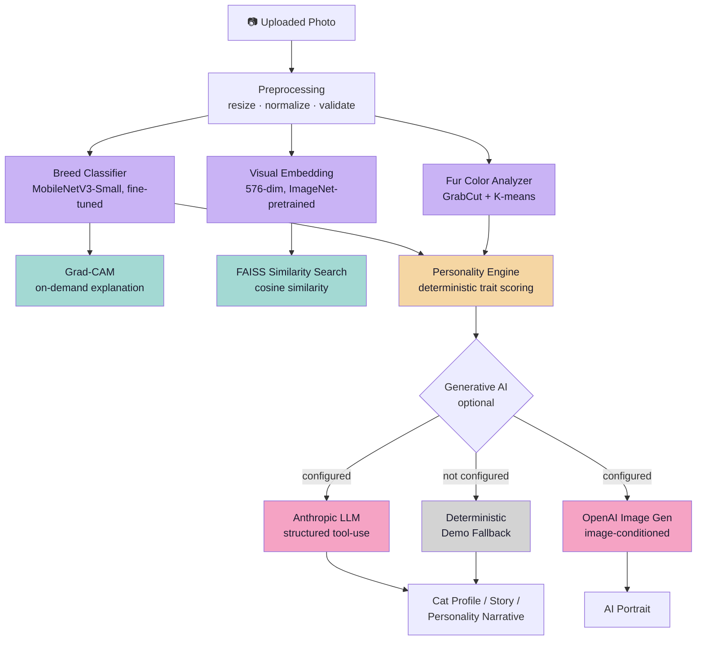
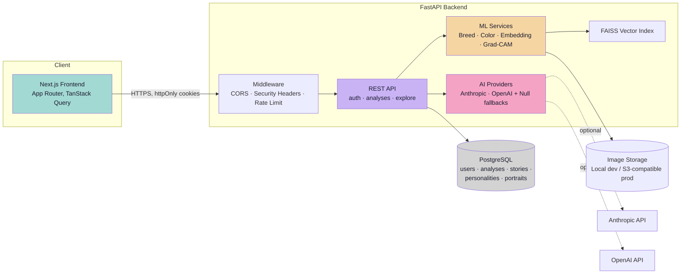

# MeowVerse 🐱✨

**Not just a cat classifier — an explainable AI platform.** Upload a
photo of a cat and MeowVerse runs it through a real, fine-tuned
computer-vision pipeline (breed classification, fur-color analysis,
visual embeddings, FAISS similarity search, from-scratch Grad-CAM
explainability), a deterministic personality-scoring engine, and an
optional generative-AI layer (structured LLM text, image-conditioned
portrait generation) — with every output honestly labeled as **real
model prediction**, **AI-generated creative content**, or **demo
fallback**, never blurred together.

Full-stack, end to end: Next.js frontend, FastAPI backend, PostgreSQL,
Docker, CI/CD, and a from-scratch Grad-CAM implementation — not a
tutorial clone, not a single Colab notebook.

[](PROJECT_STATUS.md)
[](PROJECT_STATUS.md)
[](backend/)
[](PRODUCTION_CHECKLIST.md)

---

## Table of Contents

- [Highlights](#-highlights)
- [AI Architecture](#-ai-architecture)
- [Machine Learning](#-machine-learning)
- [Generative AI](#-generative-ai)
- [System Architecture](#%EF%B8%8F-system-architecture)
- [Engineering & Security](#%EF%B8%8F-engineering--security)
- [Testing](#-testing)
- [Local Development](#-local-development)
- [Production](#-production)
- [Known Limitations](#%EF%B8%8F-known-limitations)
- [Documentation](#-documentation)
- [Screenshots](#-screenshots)

---

## ✨ Highlights

- 🧬 **Real breed classification** — MobileNetV3-Small fine-tuned on the Oxford-IIIT Pet dataset (12 cat breeds), 87.5% top-1 / 98.6% top-3 accuracy on a genuine held-out test set, re-evaluated and reproduced independently in [AI_VALIDATION_REPORT.md](AI_VALIDATION_REPORT.md).
- 🎨 **Fur color analysis** — OpenCV GrabCut foreground segmentation + K-means clustering, mapped to a named palette.
- 🔍 **"Cats Like This"** — real 576-dim visual embeddings, exact cosine-similarity search via [FAISS](https://github.com/facebookresearch/faiss), SQL-level privacy filtering.
- 🩻 **Grad-CAM explainability** — implemented from scratch (not a wrapper library) against the classifier's real gradients, showing *why* the model predicted a given breed.
- 🧠 **AI-inspired personality** — 8 trait scores from a deterministic, documented rules engine (no LLM, no randomness), plus an optional LLM-written archetype narrative that structurally cannot alter the scores.
- 📖 **AI-generated cat stories** — structured, tool-use LLM generation (Anthropic), 5 selectable styles, honest offline fallback when no API key is configured.
- 🖼️ **AI Portrait Studio** — image-conditioned generation (OpenAI `gpt-image-1`) using the cat's *actual photo* as identity reference, 10 styles, never a stock/generic image.
- 🌌 **Cat Universe** — a privacy-first public discovery area (search/filter/sort, deterministic "Featured Cats," breed/personality/color explorers) — not a social network; no comments, DMs, or follower system.
- 🐳 **Production-grade engineering** — Dockerized ML pipeline (verified running real inference in-container), CI/CD, Alembic migrations, security headers, CSRF, rate limiting, S3-compatible storage abstraction.

---

## 🧠 AI Architecture



Every box above is real code, not a diagram of intent — see
[docs/ML_PIPELINE.md](docs/ML_PIPELINE.md) for the component-by-component
breakdown of what's **trained**, what's **deterministic**, what's
**LLM-generated**, and what's **demo fallback**.

---

## 🔬 Machine Learning

| Component | Technique | Detail |
|---|---|---|
| **Breed classification** | Transfer learning (MobileNetV3-Small, ImageNet-pretrained, fully fine-tuned) | Trained on Oxford-IIIT Pet (CC BY-SA 4.0), 12 cat breeds, 2,371 images, 70/15/15 split, seed=42. 87.5% top-1 / 98.6% top-3 accuracy on held-out test set. |
| **Fur color analysis** | OpenCV GrabCut (foreground segmentation) → scikit-learn K-means (k=3) → nearest-neighbor palette naming | Deterministic (RNG-seeded); an explicit *visual estimation*, not a colorimetrically calibrated measurement. |
| **Visual embeddings** | 576-dim feature vector from an ImageNet-pretrained MobileNetV3-Small (deliberately *not* the fine-tuned breed classifier, so similarity isn't just a breed-label lookup) | L2-normalized, cosine similarity via inner product. |
| **Similarity search** | [FAISS](https://github.com/facebookresearch/faiss) `IndexFlatIP` (exact, not approximate) | Mathematically verified with controlled vector tests (identical/orthogonal/opposite/ranked); no fabricated benchmark presented as more than it is. |
| **Explainability** | Grad-CAM (Selvaraju et al., 2017), implemented from scratch with PyTorch forward/backward hooks against the real classifier's gradients | Target layer verified empirically (`features[-1]`, a (576,7,7) feature map), not assumed. |
| **Personality scoring** | Deterministic rules engine, zero ML/LLM/randomness | `score = clamp(round(50 + confidence_scale × (breed_offset + color_offset + entropy_offset)), 0, 100)` over 8 traits. |

Full methodology, dataset statistics, confusion-matrix analysis,
confidence calibration, and non-cat robustness testing (including the
honestly-reported limitation that there is **no cat/non-cat detection
gate**) are in [AI_VALIDATION_REPORT.md](AI_VALIDATION_REPORT.md) —
an independent validation pass with no fabricated metrics.

## 🤖 Generative AI

- **Anthropic (Claude)** — used only for creative *text*: story
  generation and personality-archetype narrative. **Forced tool use**:
  the tool's `input_schema` is generated directly from the Pydantic
  response schema, so the model cannot return anything but that exact
  shape. The schema structurally has no fields for breed/color/trait
  scores — the LLM cannot overwrite real CV signals because it has
  nowhere to put them, not because a prompt asked nicely.
- **OpenAI (`gpt-image-1`)** — image-conditioned portrait generation
  using the cat's real photo as the primary identity reference, not a
  text-only prompt. A backend-only prompt builder assembles every
  prompt from real signals; user-supplied text is sanitized and
  structurally confined, never able to override identity-preservation
  rules.
- **Deterministic fallback everywhere** — no API key configured (or a
  live call fails) → a clearly-labeled, deterministic offline
  placeholder is shown instead. The app is **fully functional** with
  zero AI provider keys configured; nothing crashes, nothing is
  silently faked.
- **Cost control** — every AI-calling endpoint is rate-limited
  server-side (never trusting a frontend button's `disabled` state),
  bounded prompt sizes, one semantic retry on invalid schema (never
  unbounded), on-demand generation with caching/deduplication (never
  auto-regenerated).

**Honesty note**: live Anthropic/OpenAI calls have **NOT been
verified** in this development environment — no API keys are
configured here. Every provider's request-construction code, retry
logic, and error handling is covered by mocked-provider tests (every
failure mode: timeout, rate limit, invalid schema, missing key), and
the honest "unavailable"/demo-fallback path is verified live. See
[AI_VALIDATION_REPORT.md](AI_VALIDATION_REPORT.md) §14–15 for the
exact scope of what was and wasn't tested.

---

## 🏗️ System Architecture



More diagrams (auth flow, similarity search flow, explainability flow,
generative-AI fallback flow) in
[docs/ARCHITECTURE_DIAGRAM.md](docs/ARCHITECTURE_DIAGRAM.md), and the
full component-by-component design writeup (38 sections) in
[ARCHITECTURE.md](ARCHITECTURE.md).

---

## 🛡️ Engineering & Security

- **Authentication** — bcrypt password hashing, DB-backed *opaque*
  session tokens (not JWT — a leaked/expired session can be revoked
  immediately server-side; see [docs/INTERVIEW_PREPARATION.md](docs/INTERVIEW_PREPARATION.md)
  for the full rationale), httpOnly + `SameSite=Lax` cookies.
- **CSRF** — `SameSite=Lax` as primary defense, plus an `Origin`-header
  check as defense-in-depth on every state-changing endpoint.
- **CORS** — environment-driven allowlist; startup refuses to boot
  with a wildcard origin in production.
- **Security headers** — CSP, `X-Content-Type-Options`,
  `Referrer-Policy`, `Permissions-Policy`, `X-Frame-Options`, HSTS on
  every response.
- **Rate limiting** — every AI-cost-bearing endpoint limited per-IP,
  with a stricter budget for the more expensive image-generation
  endpoint; general browsing and auth endpoints have their own
  separately-tuned limits.
- **Image upload security** — content-type allowlist, size limits, an
  explicit maximum-dimension ceiling, and a fixed decompression-bomb
  bug (Pillow's own guard wasn't being caught — found via a real Docker
  functional test, not just code review).
- **Privacy model** — every private resource enforced at the SQL query
  level (never fetch-then-check in application code); a private cat is
  invisible to search, similarity results, and discovery listings —
  not just hidden from its direct URL.
- **Ownership enforcement** — every mutating/regenerating endpoint is
  owner-only; there is no "public OR owned" path for cost-bearing
  operations like portrait generation.

---

## 🧪 Testing

| Suite | Result |
|---|---|
| Backend (`pytest`) | **457 passed, 1 skipped** (458 collected) |
| Frontend (`vitest`) | **193/193 passed** |
| Backend lint (`ruff`) | clean |
| Frontend lint (`eslint`) | clean |
| Frontend types (`tsc --noEmit`) | clean |
| Frontend production build (`next build`) | clean |
| Docker (backend + frontend production images) | built, started, and functionally verified against real endpoints |
| Production-like E2E (26 steps, against the built Docker images) | passed, zero unexpected console errors |

What "tested" actually means here: real trained-model inference
verified end-to-end inside a running Docker container (not just
imported and asserted), a real Postgres migration cycle (fresh
upgrade → full downgrade → re-upgrade) run against an isolated
database, mathematical correctness tests for the similarity engine
(identical/orthogonal/opposite/ranked vectors, not just HTTP-response
assertions), and gradient-dependence tests for Grad-CAM (a different
target class must produce a different heatmap). No test count above is
estimated — see [PROJECT_STATUS.md](PROJECT_STATUS.md) and
[AI_VALIDATION_REPORT.md](AI_VALIDATION_REPORT.md) for the full
breakdown, including what was found and fixed along the way.

---

## 🚀 Local Development

Requires Docker Desktop.

```bash
cp backend/.env.example backend/.env
cp frontend/.env.example frontend/.env
docker compose up --build
```

- Frontend: http://localhost:3000
- Backend API docs: http://localhost:8000/docs
- Health check: http://localhost:8000/health
- Readiness check (DB + Redis): http://localhost:8000/ready

<details>
<summary><strong>Running without Docker</strong></summary>

**Backend**
```bash
cd backend
python -m venv .venv && source .venv/Scripts/activate  # or .venv/bin/activate on macOS/Linux
pip install -r requirements-dev.txt
uvicorn app.main:app --reload
```

**Frontend**
```bash
cd frontend
pnpm install
pnpm dev
```

**Tests & lint**
```bash
# backend (needs a local Postgres — see docker-compose.yml, host port 5433)
cd backend && pytest && ruff check .

# frontend
cd frontend && pnpm lint && pnpm typecheck && pnpm test && pnpm build
```

**Enabling real computer vision** (without it, breed/color analysis run in a
clearly-labeled, deterministic demo mode):
```bash
cd backend
pip install -r requirements-ml.txt --extra-index-url https://download.pytorch.org/whl/cu118
python -m ml.scripts.prepare_dataset        # downloads Oxford-IIIT Pet, cat breeds only
python -m ml.training.train_breed_classifier # ~15-20 min on CPU
python -m ml.evaluation.evaluate            # real accuracy/F1/confusion matrix
```

**Enabling real generative AI** (without it, the app runs on its
deterministic offline fallback — nothing crashes, nothing is faked):
set `ANTHROPIC_API_KEY` and/or `OPENAI_API_KEY` in `backend/.env`, restart.

</details>

---

## 🐳 Production

```
Frontend  → any Next.js-capable host, or the included frontend/Dockerfile's
            `runner` stage (real `next build`, output: "standalone")
Backend   → the included backend/Dockerfile (multi-stage, real ML deps installed)
Database  → a managed PostgreSQL instance (never the dev docker-compose service)
Storage   → an S3-compatible object store (AWS S3 / Cloudflare R2 / Backblaze B2 /
            DigitalOcean Spaces) via IMAGE_STORAGE_PROVIDER=s3
AI APIs   → Anthropic (LLM) / OpenAI (image generation) — both optional
```

`docker-compose.prod.yml` builds and runs both production images
locally (no bind-mounted source, no hot-reload) so the actual
deployment artifact can be verified before it ships — **verified this
way**: a real photo uploaded to the running production backend
container returned `breed_mode: "trained"`, a correct breed
prediction, and a working Grad-CAM heatmap.

See [PRODUCTION_CHECKLIST.md](PRODUCTION_CHECKLIST.md) for the full
pre-deploy walkthrough (environment, secrets, migrations, storage,
security headers, CI/CD, backups, logging) and
[docs/CASE_STUDY.md](docs/CASE_STUDY.md) for the engineering decisions
behind each choice.

---

## ⚠️ Known Limitations

Stated plainly, not hidden:

- **No cat/non-cat detection gate.** The breed classifier is a 12-way
  softmax over cat breeds only — a non-cat photo gets a confident
  (sometimes *very* confident) breed label instead of a "not a cat"
  result. Found and measured during validation (a dog photo classified
  as "Abyssinian" at 94.5% confidence); deliberately not patched with
  a bolted-on second model without a properly scoped follow-up.
- **Live Anthropic/OpenAI calls not verified** in this development
  environment — no API keys are configured here. The fallback and
  error-handling paths are fully tested; a live generation is not.
- **In-memory rate limiter** — correct for a single instance, does not
  share counters across multiple backend processes. A Redis-backed
  implementation is a documented drop-in, not built (no multi-instance
  deployment need exists yet).
- **Real S3 credentials not exercised.** `S3ImageStorageProvider` is
  implemented and unit-tested against a mocked client; no live bucket
  call has been made.
- **No password reset / email verification flow** — no email
  infrastructure exists yet.
- **4.4% of test-set predictions were confidently (≥80%) wrong** — a
  real, measured calibration gap, reported rather than smoothed over.

---

## 📖 Documentation

| Doc | What it covers |
|---|---|
| [ARCHITECTURE.md](ARCHITECTURE.md) | Full system design, 38 sections, every phase's architectural decisions |
| [AI_VALIDATION_REPORT.md](AI_VALIDATION_REPORT.md) | Independent AI/ML validation — real metrics, no fabrication |
| [PROJECT_STATUS.md](PROJECT_STATUS.md) | What's done, real results, known gaps, phase-by-phase history |
| [ROADMAP.md](ROADMAP.md) | The full 18-phase build plan |
| [PRODUCTION_CHECKLIST.md](PRODUCTION_CHECKLIST.md) | Pre-deploy checklist |
| [docs/CASE_STUDY.md](docs/CASE_STUDY.md) | Engineering case study — problem, decisions, real bugs found |
| [docs/ML_PIPELINE.md](docs/ML_PIPELINE.md) | Component-by-component ML pipeline, trained vs. deterministic vs. generated |
| [docs/ARCHITECTURE_DIAGRAM.md](docs/ARCHITECTURE_DIAGRAM.md) | Diagrams: system, ML pipeline, auth, similarity, explainability, generative AI |
| [docs/INTERVIEW_PREPARATION.md](docs/INTERVIEW_PREPARATION.md) | Technical interview Q&A grounded in the real implementation |
| [docs/PROJECT_STORY.md](docs/PROJECT_STORY.md) | How this evolved from a simple classifier idea |

---

## 📸 Screenshots

_Coming soon — see [docs/SCREENSHOT_PLAN.md](docs/SCREENSHOT_PLAN.md)
for the shot list._

| | | |
|---|---|---|
| *Landing / Hero* | *Cat analysis result* | *Grad-CAM explanation* |
| *Similar cats* | *Personality* | *AI story* |
| *Portrait Studio* | *Collection* | *Explore* |
