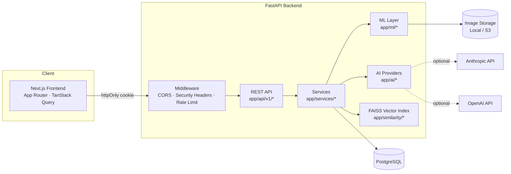
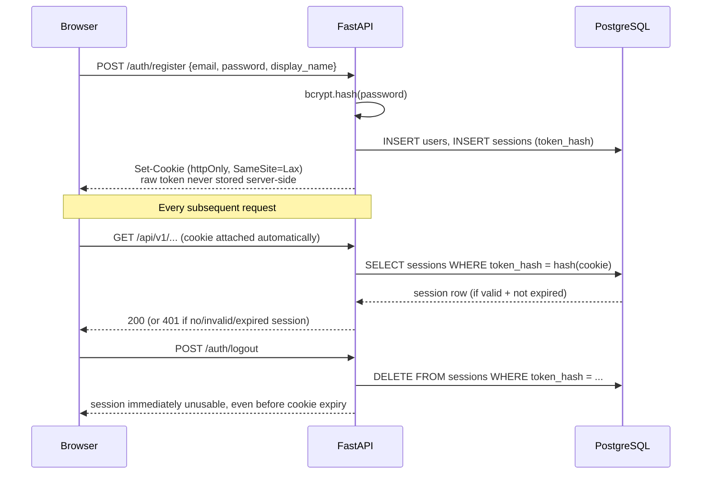
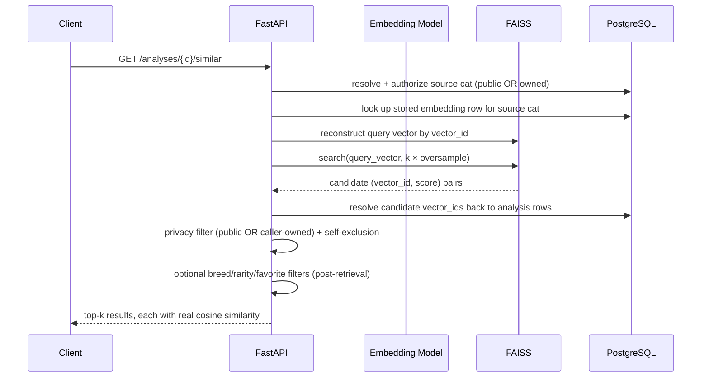
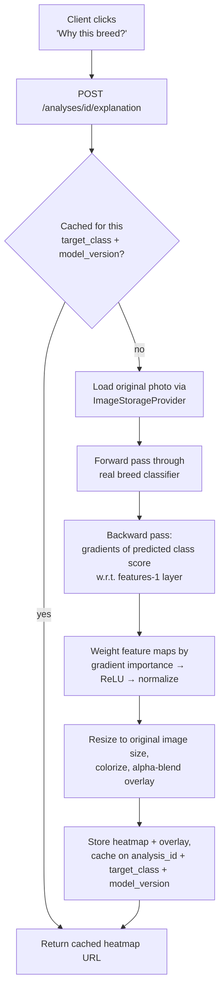
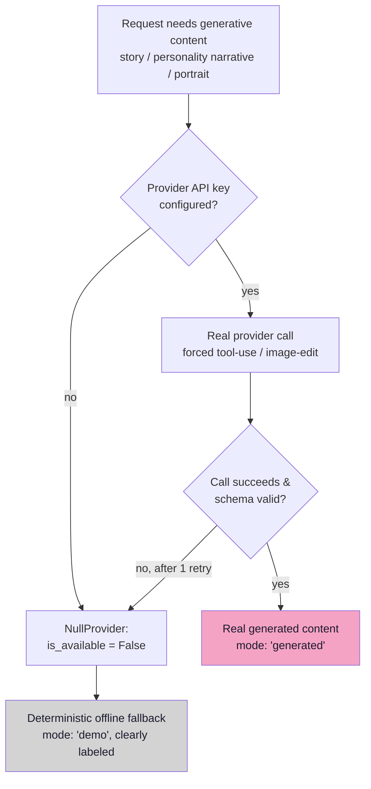

# MeowVerse — Architecture Diagrams

Companion to [ARCHITECTURE.md](../ARCHITECTURE.md)'s full written
design (38 sections). These diagrams are meant to be legible in a
technical interview — each one maps directly to real code, referenced
inline.

## A. System Architecture

Real request path: `app/main.py` wires `CORSMiddleware` →
`SecurityHeadersMiddleware` → the FastAPI routers in
`app/api/v1/`. Each router calls into `app/services/`, which
orchestrates `app/ml/` (breed/color/embedding/Grad-CAM),
`app/ai/` (LLM/image-gen providers), `app/similarity/`
(FAISS), and the SQLAlchemy repositories in `app/repositories/`.

## B. ML Pipeline

See [ML_PIPELINE.md](ML_PIPELINE.md) for the full, labeled
(TRAINED/DETERMINISTIC/LLM-GENERATED/DEMO FALLBACK) diagram.

## C. Authentication Flow

Sessions are **opaque, DB-backed tokens**, not JWT — only the *hash*
of the token is stored (`app/core/security.py`), mirroring password
hashing's own "a DB leak shouldn't hand over usable sessions"
principle. See
[docs/INTERVIEW_PREPARATION.md](INTERVIEW_PREPARATION.md) for the
JWT-vs-session-token trade-off discussion.

## D. Similarity Search Flow

Privacy filtering happens **after** retrieval but **before** the
response is built — a private candidate is discarded in-process, never
sent to the client and hidden client-side. Guests and other users can
never see a private cat's existence via this endpoint, even indirectly
through a similarity score.

## E. Explainability Flow (Grad-CAM)

Caching key is `(analysis_id, target_class, breed_model_version)` —
if the classifier is ever retrained, a stale explanation can never be
served against the new model version.

## F. Generative AI Fallback Flow

Every path terminates in either real, clearly-labeled AI-generated
content or a clearly-labeled deterministic fallback — never a crash,
never an ambiguous or silently-faked result.
